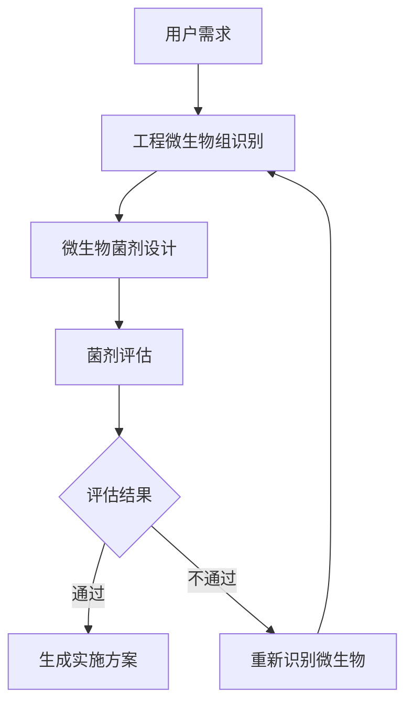

# 完整工作流程说明

## 概述

本项目实现了一个完整的微生物菌剂设计和评估工作流程，包含三个主要阶段：
1. 工程微生物组识别
2. 微生物菌剂设计
3. 菌剂评估

## 工作流程图

## 详细流程说明

### 1. 工程微生物组识别阶段

#### 1.1 输入
- 用户需求描述（如"处理含有邻苯二甲酸的工业废水"）
- 污染物相关信息

#### 1.2 处理过程
1. 使用EnviPathTool查询环境污染物生物转化路径数据
2. 使用KeggTool查询KEGG数据库中的生物通路和基因组数据
3. 使用PollutantDataQueryTool查询指定污染物的所有相关数据
4. 使用NCBIGenomeQueryTool查询NCBI数据库中的微生物基因组数据
5. 使用MicrobialComplementarityDBQueryTool查询微生物互补性数据

#### 1.3 输出
- 识别出的功能微生物列表
- 微生物的基因组和代谢信息
- 微生物间的互补性分析结果

### 2. 微生物菌剂设计阶段

#### 2.1 输入
- 工程微生物组识别阶段的输出结果
- 用户需求描述

#### 2.2 处理过程
1. 使用GenomeSPOTTool预测微生物的环境适应性特征
2. 使用DLkcatTool预测降解酶对于特定底物的降解速率
3. 使用CarvemeTool构建基因组规模代谢模型(GSMM)
5. 使用IntegratedGenomeProcessingTool整合基因组处理结果

#### 2.3 输出
- 微生物菌剂组成
- 各微生物的代谢模型
- 菌剂的代谢通路分析

### 3. 菌剂评估阶段

#### 3.1 输入
- 微生物菌剂设计阶段的输出结果

#### 3.2 处理过程
1. 使用ReactionAdditionTool为代谢模型添加特定反应
2. 使用MediumRecommendationTool生成推荐培养基组分
3. 使用CtfbaTool计算微生物群落的代谢通量
4. 使用EvaluationTool分析和评估微生物菌剂效果

#### 3.3 输出
- 菌剂评估报告
- 代谢通量分析结果
- 培养基推荐方案
- 最终评估结论（通过/不通过）

## 工具调用关系

### 工程微生物组识别智能体工具调用
- EnviPathTool
- KeggTool
- PollutantDataQueryTool
- OrganismDataQueryTool
- PollutantSummaryTool
- NCBIGenomeQueryTool
- MicrobialComplementarityDBQueryTool

### 微生物菌剂设计智能体工具调用
- EnviPathTool
- KeggTool
- PollutantDataQueryTool
- OrganismDataQueryTool
- PollutantSummaryTool
- NCBIGenomeQueryTool
- GenomeSPOTTool
- DLkcatTool
- CarvemeTool
- IntegratedGenomeProcessingTool

### 菌剂评估智能体工具调用
- ReactionAdditionTool
- MediumRecommendationTool
- CtfbaTool
- EvaluationTool

## 输出文件说明

### 1. 代谢模型文件
- **路径**: `outputs/metabolic_models/`
- **格式**: SBML XML格式
- **内容**: 微生物基因组规模代谢模型

### 2. 培养基推荐文件
- **路径**: `outputs/test_medium.csv`
- **格式**: CSV格式
- **内容**: 推荐的培养基组分及其浓度

### 3. 测试结果文件
- **路径**: `test_results/`
- **格式**: TXT和JSON格式
- **内容**: 各阶段的测试结果和日志

### 4. 工具调用记录
- **路径**: `test_results/tool_call_log_*.json`
- **格式**: JSON格式
- **内容**: 工具调用的详细记录

## 错误处理和回退机制

### 评估失败处理
当菌剂评估阶段失败时，系统会：
1. 分析失败原因
2. 回退到工程微生物组识别阶段
3. 重新识别和选择微生物
4. 重新执行完整流程

### 模型问题处理
当代谢模型存在问题时：
1. 检查模型文件完整性
2. 验证反应和边界条件
3. 重新生成模型文件
4. 重新执行评估流程

## 最佳实践建议

### 1. 模型验证
- 确保所有代谢模型包含正确的反应和边界条件
- 验证模型能够处理目标污染物
- 检查模型的完整性和一致性

### 2. 工具使用
- 按照正确的顺序调用工具
- 处理工具返回的错误信息
- 记录工具调用过程和结果

### 3. 结果分析
- 仔细分析评估结果
- 根据评估反馈调整设计方案
- 确保最终方案满足所有核心标准